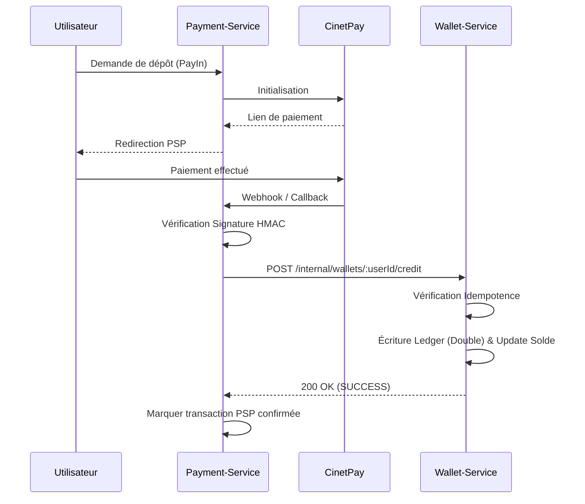

# Intégration Payment-Service <-> Wallet-Service

Ce document décrit le flux d'intégration entre le service de paiement (qui traite les dépôts et retraits avec le PSP comme CinetPay) et le service de portefeuille (qui gère les soldes via le ledger en partie double).

## Flux Nominal (Dépôt)



## Contrat d'Interface

Le `wallet-service` exige les champs suivants pour tout crédit/débit interne (S2S) :

**Endpoint** : `POST /internal/wallets/:userId/credit`
**Headers** :
- `x-api-key`: `[GXP_INTERNAL_API_KEY]`

**Body (JSON)** :
```json
{
  "type": "DEPOSIT",
  "amount": "15000",
  "currency": "XAF",
  "externalRef": "cinetpay_tx_987654321",
  "idempotencyKey": "req_abc123",
  "description": "Dépôt Mobile Money"
}
```

## Gestion des Erreurs et Résilience

> [!WARNING]
> Si le `wallet-service` est indisponible au moment de la confirmation par CinetPay, le `payment-service` doit rejouer la requête ultérieurement (cron job ou queue de type RabbitMQ/SQS).

1. **Timeout ou 5xx** : Le `payment-service` doit rejouer la requête HTTP (Exponential Backoff).
2. **Idempotence** : Le `wallet-service` utilise `idempotencyKey` et `externalRef` pour bloquer les doublons. Si une requête est rejouée après un succès non reçu par l'appelant, le `wallet-service` répond `200 OK` avec `status: ALREADY_PROCESSED`. Le `payment-service` peut alors marquer la transaction comme confirmée sans risque de double-crédit.
3. **Fonds Insuffisants (Débit)** : Retourne un 400 avec `error: INSUFFICIENT_FUNDS`. Le `payment-service` doit alors annuler le PayOut.
